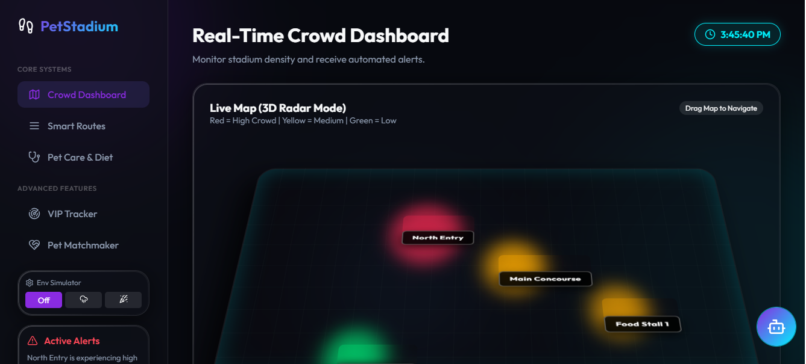

# 🏟️ Pet-Friendly Smart Stadium System

 <!-- Add a screenshot link later -->

A highly futuristic, full-stack Management System built specifically for venues anticipating massive crowds and their pets. 

This platform redefines physical event experiences by providing **interactive 3D spatial mapping**, **live decibel analytics**, **VIP pet tracking radars**, and a **Google Gemini AI Assistant** to seamlessly guide attendees toward low-noise routes and pet-relief zones.

---

## ☁️ Google Cloud Architecture

This ecosystem leverages extremely modern, enterprise-grade Google APIs to drive durability, observability, and generative artificial intelligence.

*   **Google Cloud Run**: Fully containerized monolithic Express/Vite architecture running seamlessly via standard `Dockerfile` execution.
*   **Google Gemini 2.5 Flash (`@google/genai`)**: Powers the Nexa AI Assistant. Gemini intelligently answers user queries by automatically injecting real-time stadium footprint models and crowd levels into the backend LLM prompt context!
*   **Google Cloud Storage (`@google-cloud/storage`)**: Guarantees data durability. Every time a new VIP Pet Holographic Pass is registered, a backup JSON receipt is independently streamed and achieved inside a highly-available GCS Bucket.
*   **Google Cloud Logging (`@google-cloud/logging`)**: Complete backend observability. Bypasses standard console logs and natively transmits API failures, Express crashed, and AI success events to the centralized GCP Logs Explorer.
*   **Google Cloud Firestore (`@google-cloud/firestore`)**: Enterprise NoSQL database tracking active alerts, zone congestion, and registered attendees natively over Application Default Credentials (ADC).

---

## 💻 Comprehensive Technology Stack

### 🎨 Frontend Architecture
*   **Framework**: React 18 (Functional Components, Hooks)
*   **Build Tool**: Vite (Lightning-fast HMR and optimized production bundling)
*   **Styling**: Pure CSS3 with modern methodologies (Glassmorphism, CSS Variables, CSS Keyframe Micro-animations)
*   **Icons & UI**: Lucide-React (Lightweight, crisp SVG iconography)
*   **Performance**: React `Suspense` and `lazy()` for dynamic code splitting and optimized chunk loading.

### ⚙️ Backend Architecture
*   **Runtime**: Node.js (v18+)
*   **Web Framework**: Express.js (REST API Architecture)
*   **Security & Optimization**: 
    *   `helmet` (HTTP header security)
    *   `cors` (Cross-Origin Resource Sharing)
    *   `express-rate-limit` (DDos & brute-force protection)
    *   `compression` (Gzip payload compression)
    *   `express-validator` (Robust API request data sanitization)

### ☁️ Cloud & AI Integration (Google Cloud Platform)
*   **PaaS Hosting**: Google Cloud Run (Fully managed serverless container execution)
*   **Generative AI**: Google Gemini 2.5 Flash via `@google/genai` (Context-aware dynamic stadium chatbot)
*   **Cloud Storage**: Google Cloud Storage via `@google-cloud/storage` (Durable JSON backup archives for VIP registrations)
*   **Cloud Observability**: Google Cloud Logging via `@google-cloud/logging` (Native Express fallback and error tracking)
*   **Database**: Google Cloud Firestore via `@google-cloud/firestore` (NoSQL scalable stadium queue tracking)

---

## ⚡ Core Features

1.  **Nexa AI Stadium Guide**: Floating intelligent Chat Assistant powered by Google Gemini, giving dynamic localized advice on the fly.
2.  **Military-Grade VIP Tracker**: A sweeping full-screen radar visualizer detecting VIP guests and chipped pets within 3KM.
3.  **Holographic Pet Passes**: Interactive 3D tilt-responsive ID cards generated featuring beautiful CSS foil reflections.
4.  **Interactive 3D Crowd Map**: A draggable, tiltable spatial map visualizing entrance waiting queues and zone population density.
5.  **Environment Simulator**: Built-in CSS particle engine demonstrating how the UI handles external variables (Rainy weather, Celebration confetti).
6.  **Pet Matchmaker Social Feed**: Social matching system pairing attendees' pets for playdates based on species, breed, and dietary preferences.
7.  **Smart Routing Matrix**: Dynamically builds step-by-step visual pipelines projecting low-noise travel paths across the stadium matrix.

---

## 🚀 Deployment Guide (Google Cloud Run)

This repository is unified! During deployment, a Dockerfile automatically scripts the Vite frontend production build and effortlessly mounts it to Express.

### Prerequisites for 100% Capabilities:
Enable these core services in your GCP Console:
```bash
gcloud services enable firestore.googleapis.com
gcloud services enable storage.googleapis.com
gcloud services enable logging.googleapis.com
gcloud services enable aiplatform.googleapis.com
gcloud services enable generativelanguage.googleapis.com
```

### Push to Production:
Use the standard gcloud CLI to containerize and spin up the architecture globally:
```bash
gcloud run deploy pet-stadium-system \
  --source . \
  --region us-central1 \
  --allow-unauthenticated \
  --clear-base-image
```

---

## 🛠️ Local Development (Offline Fallbacks)

The system is uniquely written to securely "downgrade" entirely to a local filesystem format if Google Cloud Services or Wi-Fi are disconnected. It will swap Firestore for absolute `db.json` files and bypass logging errors seamlessly.

```bash
# 1. Install global dependencies
npm install

# 2. Build the Vite Frontend explicitly into the public directory
npm run build --prefix frontend
mv frontend/dist public

# 3. Start the Express App
npm start

# Access locally at http://localhost:5000
```
